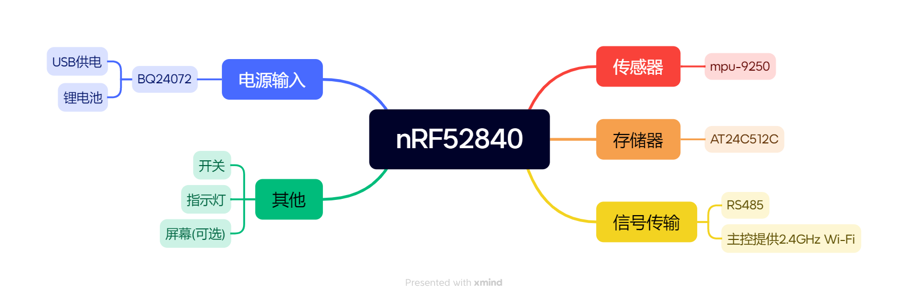

# 姿态遥控器项目说明

English version: [English](./README_en.md)

## 这是什么 :no_mouth:
* 这是一个遥控器项目，使用姿态传感器来获取手势信号来控制对象。

## 外观&怎么使用 :smiley_cat:
* 黑色长方体，尺寸为60mm*50mm*20mm，重量约50g。
* 通过有线或无线连接操控对象后，以顶面所在平面为竖直面，握住遥控器，通过手部运动来控制对象。
* 操作以小车为例：向前倾，小车前进；向后倾，小车后退；向左倾，小车左转；向右倾，小车右转。倾角越大，对应速度越快。
* 进行控制时需按住遥控器上的按钮，松开按钮后，遥控器进入待机状态，待机状态下，遥控器可以立即唤醒。

## 项目特点 :star:
1. 操控上抛弃传统双摇杆精确控制方式，转而采用手部运动信号，以直观的，容易理解的控制方式进行人机交互，单手操作，优雅自如。
2. 信号传输上采用有线与无线并存的形式，可以在复杂电磁环境，不同距离下稳定操纵对象。
3. 大小远远优于传统遥控器，预计整体不超过一张普通IC卡，可以轻松放入口袋，携带方便。
4. 采用高集成度，多功能的电源管理芯片，对电流流向，充电模式，电流大小进行精确控制，保证电源供电平稳，确保系统整体工作的稳定。
5. 内置锂电池，有一定的独立供电能力。
6. 待机时间长，可以立即唤醒。有指示灯清晰指示。
7. 设计优雅，美观；对极端环境有一定耐受性。

## 系统架构 :four_leaf_clover:

## 技术方案
* 姿态信号算法：采用MPU-9250姿态传感器采集手部运动信号，通过卡尔曼滤波算法对信号进行滤波，然后通过姿态识别算法对信号进行识别，最终输出对应控制信号。
* 信号传输：采用有线和无线两种方式传输控制信号，有线传输采用RS485协议，无线传输采用2.4GHz Wi-Fi协议。
* 天线设计：采用内置+可拆卸外置天线，保证在不同环境下的信号传输稳定性。

## 需要的知识和技能 :books:
* 熟悉嵌入式系统开发，熟悉C语言编程
* 熟悉nRF52840芯片及其开发环境
* 熟悉MPU-9250姿态传感器及其应用
* 熟悉各种通信协议，如UART、SPI、I2C、RS485等，了解Wi-Fi协议
* 熟悉电源管理知识，如锂电池充电、电源管理电路等
* 熟悉调试器和烧录器及其应用
* 了解如何对干扰进行处理，如电磁干扰、温度变化等
* 适当了解卡尔曼滤波算法及其应用
* 了解姿态识别算法及其应用
* 学习思考外观设计，了解外观设计的基本原则和技巧
* 熟悉PCB设计
* 熟悉PCB制版

## 应用场景 :bullettrain_front:
* 无人机控制
* 无人车控制
* 机械臂控制

## 风险评估 :zap:
* 硬件设计风险：硬件设计需要考虑各种环境因素，如电磁干扰、温度变化等，需要确保硬件设计的鲁棒性。nRF52840主控资源有限，需要考虑如何高效地利用这些资源，以实现系统的性能和稳定性。如果主控芯片的性能不足，需要考虑更换其他性能更好的芯片。
* 软件开发风险：软件开发需要考虑各种可能的错误和异常情况，需要确保软件的稳定性和可靠性。还要考虑到学习成本和开发周期，需要确保项目进度的控制。
* 供应风险：硬件和软件的供应可能会受到各种因素的影响，如一些特殊部件供应商的生产计划变更、交货延迟等，需要确保供应的稳定性和可靠性。
* 安排风险：项目进度安排需要考虑各种因素，如技术难题、时间安排、合作方式等，需要确保项目进度的控制。

## 项目进度安排 :calendar:

| 成员   | 任务                                                    | 日期                           |
|--------|--------------------------------------------------------|--------------------------------|
| LilaMew | 外观3D模型设计，总电路制作，主代码编写；总体统筹规划        | 模型设计完成；其他到最终验收日期  |
| 奕欢 | 独立有线及无线通信设计，天线设计；通信部分代码编写          | 通信设计到2025/2/5；其他同上     |
| chu7-1 | 独立电源复位烧录按键指示电路，操作方式设计，合理与易用性考察 | 外围电路设计到2025/1/20；其他同上|

## 项目预期成果 :apple:
* 完成姿态遥控器通信外的设计和开发，实现手部运动信号采集和运算。
* 实现有线和无线信号传输，确保在不同环境下的稳定操控。
* 实现待机唤醒和指示灯功能。
* 实现一套完善的操作方法。
* 实现优雅美观的设计，满足用户对外观的需求。
* 实现对极端环境的耐受性。